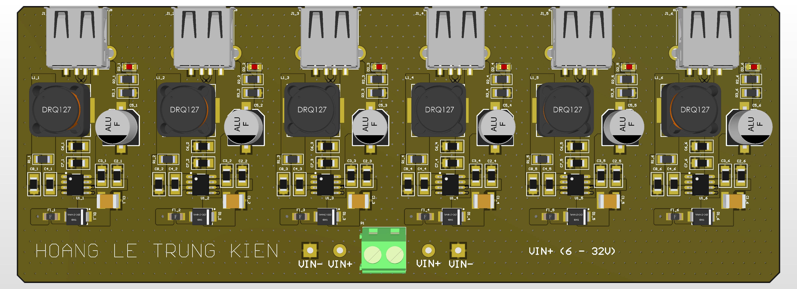

# 6-Port USB Fast Charging Hub — 4-Layer PCB



> **Status:** Design Complete — DRC Clean  
> **Tool:** Altium Designer (Multi-Channel) | **PCB:** 4-Layer, JLCPCB stackup  
> **Date:** 2026

---

## Overview

Desktop USB charging station delivering 5V/3A per port across 6 independent power channels, with a 10A total output design target. Each channel is built around an IP6505 synchronous buck converter. The entire 6-channel layout was completed using Altium's multi-channel replication feature — routing one channel and replicating it five times — cutting layout effort by approximately 70%.

---

## Specifications

| Parameter | Value |
|-----------|-------|
| Input voltage | 12V DC |
| Output voltage | 5V per port |
| Output current | 3A max per port |
| Total output | 10A (design target) |
| Channels | 6 independent |
| Switching IC | IP6505 (INJOINIC) synchronous buck |
| Switching frequency | ~600 kHz |
| PCB layers | 4 |
| Target fab | JLCPCB 4-layer stackup |

---

## Block Diagram

```
12V DC Input ── P1 (screw terminal)
      │
  F_main (10A blade fuse)
      │
  C_main (1000µF bulk) ──── 12V_BUS
      │
  ┌───┼───┬───┬───┬───┐
  │   │   │   │   │   │
 F1  F2  F3  F4  F5  F6   (5A per channel fuse)
  │   │   │   │   │   │
 U1  U2  U3  U4  U5  U6   (IP6505 × 6)
  │   │   │   │   │   │
 L1  L2  L3  L4  L5  L6   (22µH inductors)
  │   │   │   │   │   │
 J1  J2  J3  J4  J5  J6   (USB-A connectors)
       5V / 3A per port
```

---

## IP6505 Channel — Per-Channel Schematic

```
12V_BUS ── F_x (5A) ── C_in_x (100µF) ── IP6505 VIN (Pin7,8)
                                               │
                                     C_boot (100nF) between BST(1) and SW(2)
                                               │
                                           SW (Pin2) ── L_x (22µH) ── VOUT_x (5V)
                                                                            │
                                                               C_out1 (220µF) + C_out2 (10µF)
                                                                            │
                                                                       J_x (USB-A)
IP6505 FB (Pin5):
  VOUT_x ── R1_x (100kΩ) ── FB ── R2_x (33kΩ) ── GND
  Vref=0.8V → Vout = 0.8×(1+100/33) ≈ 3.2V ... adjust R values
  [Actual: check schematic for exact resistor values]

IP6505 EN (Pin6): tied to 12V_BUS (always enable)
IP6505 EP (Exposed Pad): GND + thermal vias to L2 GND plane
```

---

## Key Design Decisions

### 1. Altium Multi-Channel Layout Replication
The 6 power channels are electrically identical. Rather than routing each independently:

1. Designed one complete channel (IP6505 + L + C_in + C_out + fuse + USB-A)
2. Created a Room in Altium encapsulating this channel
3. Used **Copy Room Format** → applied to 5 remaining channels
4. All 6 channels have identical component placement and routing

Result: routing effort reduced by ~70%. Any layout change to one channel (e.g., adjusting via placement) is applied to all channels simultaneously.

### 2. Power Trace Sizing — IPC-2221
Power traces must carry per-channel peak current without overheating.

```
IPC-2221 formula (external layer, 1 oz copper, ΔT=10°C):
Width = (I / (k × ΔT^0.44))^(1/0.725)
      = (3 / (0.048 × 10^0.44))^(1/0.725)
      ≈ 2.0 mm

Design margin: 2.5 mm traces used for all 3A paths
Input bus (10A): 5.0 mm minimum → copper pour used instead
```

### 3. Thermal Management — Copper Pours
The IP6505 EP (exposed pad) is a primary heat dissipation path. Each IC has:
- Thermal via array under EP: 4×4 grid, 0.3mm drill, to L2 GND plane
- Top-layer copper pour surrounding the switching node for heat spreading
- High-frequency switching nodes (BST, SW) isolated from USB signal areas by ground copper separation

### 4. Bootstrap Capacitor Placement
The 100nF bootstrap capacitor (C_boot) between BST and SW pins must be placed as close as possible to the IC to minimize parasitic inductance in the bootstrap charge path. In the layout, C_boot is placed within 0.5mm of the IC pins.

### 5. Input Capacitor Per Channel
Each channel has a dedicated 100µF input capacitor in addition to the shared 1000µF bulk. This localizes the high-frequency current loop (SW ripple current) to each channel, preventing channel-to-channel interference on the 12V bus.

### 6. USB D+/D− Short (Dumb Charger Mode)
D+ and D− are shorted on each USB port. This signals to connected devices that the port is a dedicated charging adapter (CDP-like), allowing most devices to draw up to 1.5A or more without USB enumeration.

---

## 4-Layer Stackup (JLCPCB)

```
L1 — Signal + Power (1 oz)    ← component routing, power pours
L2 — GND plane (0.5 oz)       ← continuous reference, thermal via landing
L3 — Power plane (0.5 oz)     ← 12V_BUS polygon pour
L4 — Signal (1 oz)             ← secondary routing
```

---

## BOM (per channel × 6 + shared)

**Per channel:**

| Ref | Part | Value |
|-----|------|-------|
| U_x | IP6505 | SOIC-8 EP, synchronous buck |
| L_x | Inductor | 22µH / 4A, SMD 12×12mm |
| C_in_x | Electrolytic | 100µF / 35V |
| C_out1_x | Electrolytic | 220µF / 16V |
| C_out2_x | Ceramic | 10µF / 16V, 0805 |
| C_boot_x | Ceramic | 100nF, 0402 |
| R1_x | Resistor | 100kΩ, 0603 |
| R2_x | Resistor | 33kΩ, 0603 |
| F_x | Fuse | 5A, 1206 |
| J_x | USB-A Female | Horizontal SMT |
| D_x | LED | Red 0603 |
| R_led_x | Resistor | 3.3kΩ, 0603 |

**Shared:**

| Ref | Part | Value |
|-----|------|-------|
| P1 | Screw terminal | 2-pin, 5mm pitch |
| F_main | Blade fuse | 10A |
| C_main1 | Electrolytic | 1000µF / 35V |
| C_main2 | Ceramic | 100nF |

---

## Files

| File | Description |
|------|-------------|
| `schematic.pdf` | Schematic |
| `docs/layout_bottom.png` | PCB layout — bottom layer |
| `docs/render.png` | Altium 3D render |
| `docs/layout_top.png` | Isometric 3D view |

---

## Tools Used
- Altium Designer 24 (hierarchical + multi-channel)
- JLCPCB 4-layer stackup + impedance calculator
- IPC-2221 trace width calculator

---

*Design by Hoang Le Trung Kien — HCMUT Electronics & Communication Engineering*
